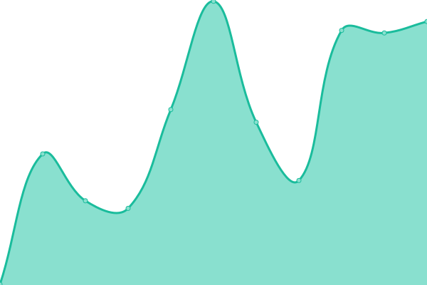
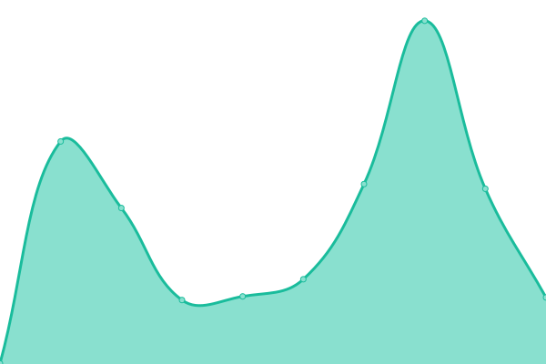

# [📈 Live Status](https://stats.wgyt.tk): <!--live status--> **🟩 All systems operational**

<!--start: status pages-->
<!-- This summary is generated by Upptime (https://github.com/upptime/upptime) -->
<!-- Do not edit this manually, your changes will be overwritten -->
<!-- prettier-ignore -->
| URL | Status | History | Response Time | Uptime |
| --- | ------ | ------- | ------------- | ------ |
|  [wgyt website](https://www.wgyt.tk) | 🟩 Up | [wgyt-website.yml](https://github.com/wgytwebsites/stats.wgyt.tk/commits/master/history/wgyt-website.yml) | 

 356ms
     
 | 

<a href="https://stats.wgyt.tk/history/wgyt-website">100.00%</a>
    

|  [wgyt api](https://api.wgyt.tk) | 🟩 Up | [wgyt-api.yml](https://github.com/wgytwebsites/stats.wgyt.tk/commits/master/history/wgyt-api.yml) | 

 329ms
     
 | 

<a href="https://stats.wgyt.tk/history/wgyt-api">100.00%</a>
    

|  [wgyt auth](https://auth.wgyt.tk) | 🟩 Up | [wgyt-auth.yml](https://github.com/wgytwebsites/stats.wgyt.tk/commits/master/history/wgyt-auth.yml) | 

 297ms
     
 | 

<a href="https://stats.wgyt.tk/history/wgyt-auth">100.00%</a>
    

|  [wgyt bot](https://bot.wgyt.tk) | 🟩 Up | [wgyt-bot.yml](https://github.com/wgytwebsites/stats.wgyt.tk/commits/master/history/wgyt-bot.yml) | 

 388ms
     
 | 

<a href="https://stats.wgyt.tk/history/wgyt-bot">100.00%</a>
    

|  [wgyt chat](https://chat.wgyt.tk) | 🟩 Up | [wgyt-chat.yml](https://github.com/wgytwebsites/stats.wgyt.tk/commits/master/history/wgyt-chat.yml) | 

 251ms
     
 | 

<a href="https://stats.wgyt.tk/history/wgyt-chat">100.00%</a>
    

|  [wgyt comments](https://comments.wgyt.tk) | 🟩 Up | [wgyt-comments.yml](https://github.com/wgytwebsites/stats.wgyt.tk/commits/master/history/wgyt-comments.yml) | 

 311ms
     
 | 

<a href="https://stats.wgyt.tk/history/wgyt-comments">100.00%</a>
    

|  [wgyt documentation](https://documentation.wgyt.tk) | 🟩 Up | [wgyt-documentation.yml](https://github.com/wgytwebsites/stats.wgyt.tk/commits/master/history/wgyt-documentation.yml) | 

 147ms
     
 | 

<a href="https://stats.wgyt.tk/history/wgyt-documentation">100.00%</a>
    

|  [wgyt.cf](https://wgyt.cf) | 🟩 Up | [wgyt-cf.yml](https://github.com/wgytwebsites/stats.wgyt.tk/commits/master/history/wgyt-cf.yml) | 

 561ms
     
 | 

<a href="https://stats.wgyt.tk/history/wgyt-cf">100.00%</a>
    

|  [wgyt on grahamsh.com](https://wgyt.grahamsh.com) | 🟩 Up | [wgyt-on-grahamsh-com.yml](https://github.com/wgytwebsites/stats.wgyt.tk/commits/master/history/wgyt-on-grahamsh-com.yml) | 

 187ms
     
 | 

<a href="https://stats.wgyt.tk/history/wgyt-on-grahamsh-com">100.00%</a>
    

<!--end: status pages-->

[**Visit our status website →**](https://stats.wgyt.tk)

## 📄 License

- Powered by: [Upptime](https://github.com/upptime/upptime)
- Code: [MIT](./LICENSE) © [Upptime](https://upptime.js.org)
- Data in the `./history` directory: [Open Database License](https://opendatacommons.org/licenses/odbl/1-0/)
