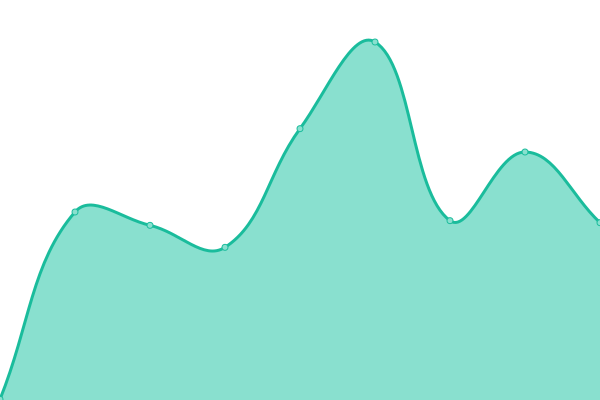
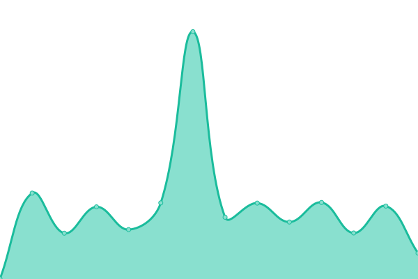
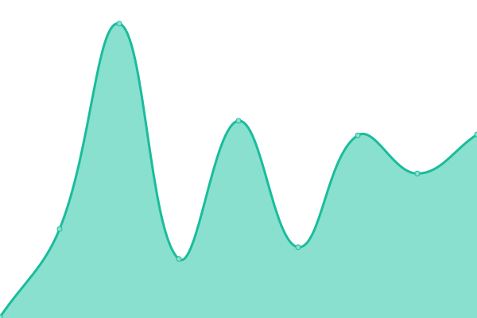
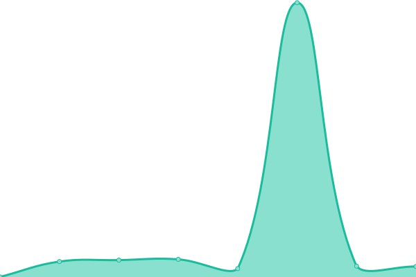
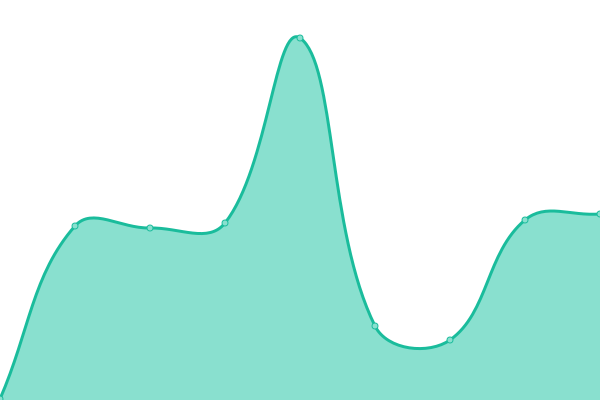
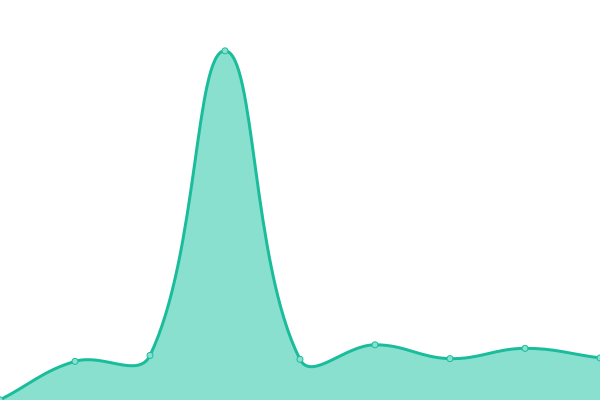
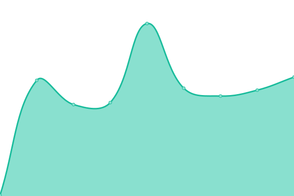
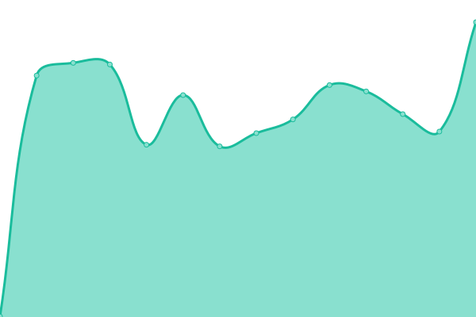
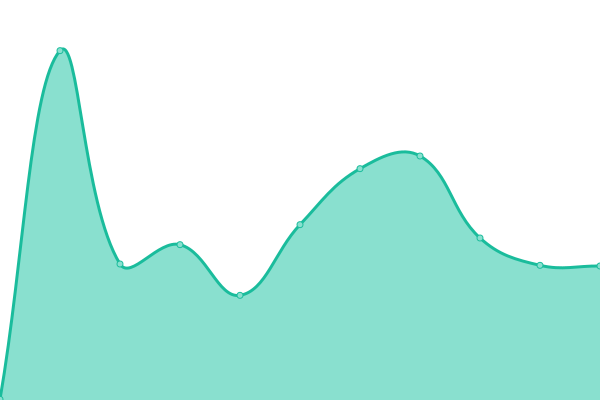
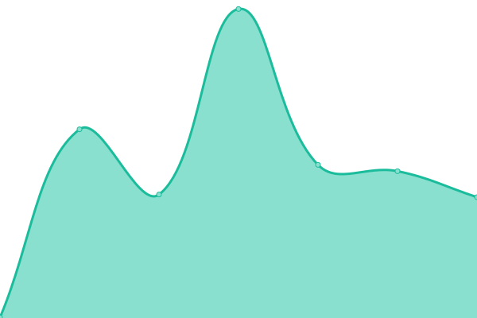

# [📈 Live Status](https://stats.wgyt.tk): <!--live status--> **🟧 Partial outage**

<!--start: status pages-->
<!-- This summary is generated by Upptime (https://github.com/upptime/upptime) -->
<!-- Do not edit this manually, your changes will be overwritten -->
<!-- prettier-ignore -->
| URL | Status | History | Response Time | Uptime |
| --- | ------ | ------- | ------------- | ------ |
|  [api.wgyt.tk](https://api.wgyt.tk/about) | 🟩 Up | [api-wgyt-tk.yml](https://github.com/wgytwebsites/stats.wgyt.tk/commits/HEAD/history/api-wgyt-tk.yml) | 

 439ms
     
 | 

<a href="https://stats.wgyt.tk/history/api-wgyt-tk">99.93%</a>
    

|  [auth.wgyt.tk](https://auth.wgyt.tk/) | 🟩 Up | [auth-wgyt-tk.yml](https://github.com/wgytwebsites/stats.wgyt.tk/commits/HEAD/history/auth-wgyt-tk.yml) | 

 315ms
     
 | 

<a href="https://stats.wgyt.tk/history/auth-wgyt-tk">100.00%</a>
    

|  [josh bot (bot.wgyt.tk)](https://bot.wgyt.tk/) | 🟩 Up | [josh-bot-bot-wgyt-tk.yml](https://github.com/wgytwebsites/stats.wgyt.tk/commits/HEAD/history/josh-bot-bot-wgyt-tk.yml) | 

 305ms
     
 | 

<a href="https://stats.wgyt.tk/history/josh-bot-bot-wgyt-tk">94.73%</a>
    

|  [documentation.wgyt.tk](https://documentation.wgyt.tk/) | 🟩 Up | [documentation-wgyt-tk.yml](https://github.com/wgytwebsites/stats.wgyt.tk/commits/HEAD/history/documentation-wgyt-tk.yml) | 

 168ms
     
 | 

<a href="https://stats.wgyt.tk/history/documentation-wgyt-tk">100.00%</a>
    

|  [social.wgyt.tk](https://social.wgyt.tk/) | 🟩 Up | [social-wgyt-tk.yml](https://github.com/wgytwebsites/stats.wgyt.tk/commits/HEAD/history/social-wgyt-tk.yml) | 

 556ms
     
 | 

<a href="https://stats.wgyt.tk/history/social-wgyt-tk">99.72%</a>
    

|  [stats.wgyt.tk (it is up lol)](https://stats.wgyt.tk/) | 🟩 Up | [stats-wgyt-tk-it-is-up-lol.yml](https://github.com/wgytwebsites/stats.wgyt.tk/commits/HEAD/history/stats-wgyt-tk-it-is-up-lol.yml) | 

 150ms
     
 | 

<a href="https://stats.wgyt.tk/history/stats-wgyt-tk-it-is-up-lol">100.00%</a>
    

|  [wgytcraft.cf](https://wgytcraft.cf/) | 🟩 Up | [wgytcraft-cf.yml](https://github.com/wgytwebsites/stats.wgyt.tk/commits/HEAD/history/wgytcraft-cf.yml) | 

 331ms
     
 | 

<a href="https://stats.wgyt.tk/history/wgytcraft-cf">99.44%</a>
    

|  [wgyt.tk](https://auth.wgyt.tk/) | 🟩 Up | [wgyt-tk.yml](https://github.com/wgytwebsites/stats.wgyt.tk/commits/HEAD/history/wgyt-tk.yml) | 

 134ms
     
 | 

<a href="https://stats.wgyt.tk/history/wgyt-tk">100.00%</a>
    

|  [wgyt.grahamsh.com](https://wgyt.grahamsh.com/) | 🟩 Up | [wgyt-grahamsh-com.yml](https://github.com/wgytwebsites/stats.wgyt.tk/commits/HEAD/history/wgyt-grahamsh-com.yml) | 

 163ms
     
 | 

<a href="https://stats.wgyt.tk/history/wgyt-grahamsh-com">100.00%</a>
    

|  [wgyt.cf](https://auth.wgyt.tk/) | 🟩 Up | [wgyt-cf.yml](https://github.com/wgytwebsites/stats.wgyt.tk/commits/HEAD/history/wgyt-cf.yml) | 

 93ms
     
 | 

<a href="https://stats.wgyt.tk/history/wgyt-cf">100.00%</a>
    

|  [simpleedit.tk](https://simpleedit.tk/) | 🟩 Up | [simpleedit-tk.yml](https://github.com/wgytwebsites/stats.wgyt.tk/commits/HEAD/history/simpleedit-tk.yml) | 

 255ms
     
 | 

<a href="https://stats.wgyt.tk/history/simpleedit-tk">100.00%</a>
    

|  [meower.tk](https://meower.tk/) | 🟩 Up | [meower-tk.yml](https://github.com/wgytwebsites/stats.wgyt.tk/commits/HEAD/history/meower-tk.yml) | 

 360ms
     
 | 

<a href="https://stats.wgyt.tk/history/meower-tk">100.00%</a>
    

|  [meowerplus.tk](https://meowerplus.tk/) | 🟩 Up | [meowerplus-tk.yml](https://github.com/wgytwebsites/stats.wgyt.tk/commits/HEAD/history/meowerplus-tk.yml) | 

 420ms
     
 | 

<a href="https://stats.wgyt.tk/history/meowerplus-tk">100.00%</a>
    

|  [mastermindstudio.tk](https://mastermindstudio.tk/) | 🟩 Up | [mastermindstudio-tk.yml](https://github.com/wgytwebsites/stats.wgyt.tk/commits/HEAD/history/mastermindstudio-tk.yml) | 

 251ms
     
 | 

<a href="https://stats.wgyt.tk/history/mastermindstudio-tk">100.00%</a>
    

|  [grocerycheck.ga](https://grocerycheck.ga/) | 🟩 Up | [grocerycheck-ga.yml](https://github.com/wgytwebsites/stats.wgyt.tk/commits/HEAD/history/grocerycheck-ga.yml) | 

 355ms
     
 | 

<a href="https://stats.wgyt.tk/history/grocerycheck-ga">99.57%</a>
    

|  [galacticaos.tk](https://galacticaos.tk/) | 🟩 Up | [galacticaos-tk.yml](https://github.com/wgytwebsites/stats.wgyt.tk/commits/HEAD/history/galacticaos-tk.yml) | 

 401ms
     
 | 

<a href="https://stats.wgyt.tk/history/galacticaos-tk">100.00%</a>
    

|  [galaxydesign.ga](https://galaxydesign.ga/) | 🟥 Down | [galaxydesign-ga.yml](https://github.com/wgytwebsites/stats.wgyt.tk/commits/HEAD/history/galaxydesign-ga.yml) | 

 405ms
     
 | 

<a href="https://stats.wgyt.tk/history/galaxydesign-ga">99.53%</a>
    

<!--end: status pages-->

[**Visit our status website →**](https://stats.wgyt.tk)

## 📄 License

- Powered by: [Upptime](https://github.com/upptime/upptime)
- Code: [MIT](./LICENSE) © [Upptime](https://upptime.js.org)
- Data in the `./history` directory: [Open Database License](https://opendatacommons.org/licenses/odbl/1-0/)
